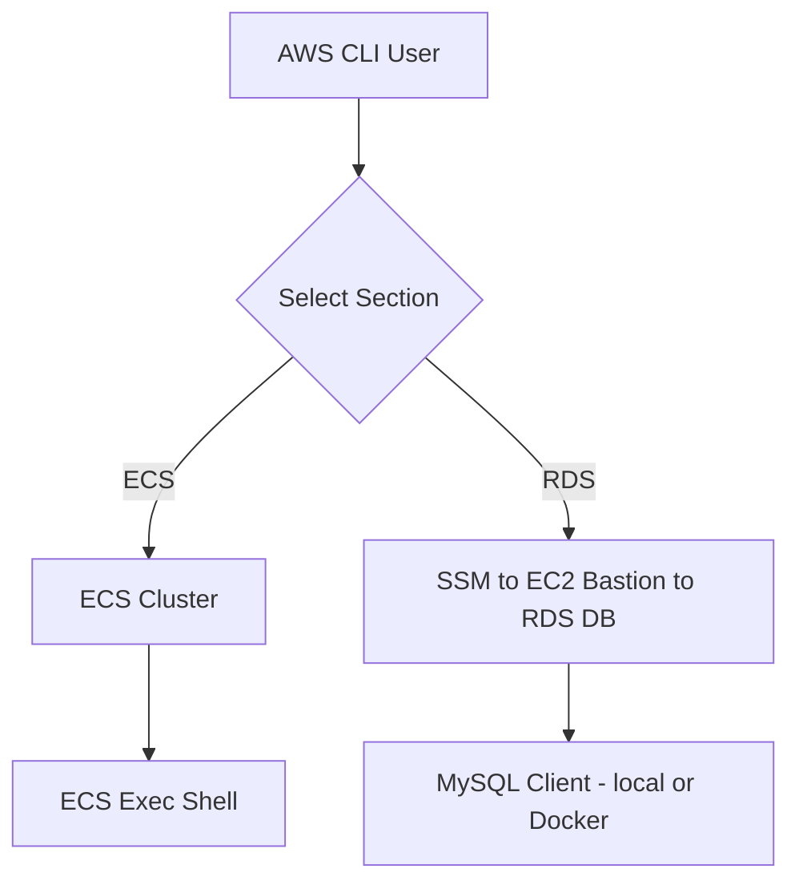

## 🧩 AWS ECS/RDS Tunnel Script

This script provides a unified way to connect to **ECS containers** or **RDS databases** via **AWS CLI**.
It allows engineers to quickly interact with ECS tasks or securely connect to RDS instances through **AWS Systems Manager (SSM) port forwarding** — using a single, flexible tool.

---

### ⚙️ Features

* 🔹 **ECS**
  Lists running ECS tasks, allows interactive task selection, and opens an **ECS Exec** shell into a container.

* 🔹 **RDS**
  Uses **SSM Session Manager** to securely port-forward traffic from a bastion EC2 instance to an **RDS database**, retrieves credentials from **AWS Secrets Manager**, and connects via `mysql` or Docker.

* 🔹 **Unified AWS Profile Handling**
  Automatically exports the configured AWS profile (default: `ca`).

* 🔹 **Minimal Dependencies**
  Works with standard CLI tools — no complex SDK setup required.

---

### 🧠 Prerequisites

Ensure the following are installed and configured:

| Dependency          | Description                                             |
| ------------------- | ------------------------------------------------------- |
| `awscli`            | For interacting with ECS, EC2, RDS, and Secrets Manager |
| `jq`                | For parsing JSON secrets                                |
| `nc`                | For verifying port readiness                            |
| `mysql` (optional)  | Local client for direct DB access                       |
| `docker` (optional) | Fallback containerized MySQL client                     |

AWS IAM permissions must include:

* `ecs:ListTasks`, `ecs:ExecuteCommand`
* `ec2:DescribeInstances`
* `ssm:StartSession`
* `rds:DescribeDBInstances`
* `secretsmanager:GetSecretValue`

---

### 🚀 Usage

#### 1️⃣ Make the script executable

```bash
chmod +x ssm-ecs-rds-tunnel.sh
```

#### 2️⃣ Run ECS section

Connect to a running ECS task interactively:

```bash
./ssm-ecs-rds-tunnel.sh
```

🪶 **What it does:**

1. Lists all running ECS tasks in the target cluster.
2. Prompts you to select a task by number (currently selects the first task by default).
3. Opens an interactive shell (`/bin/sh`) into the container.

---

#### 3️⃣ Run RDS section

Connect to an RDS database via SSM port-forward:

```bash
./ssm-ecs-rds-tunnel.sh
```

🪶 **What it does:**

1. Finds a running EC2 instance with the matching tag name.
2. Locates the RDS endpoint and establishes an SSM port-forward tunnel.
3. Fetches credentials from AWS Secrets Manager.
4. Connects to MySQL using local CLI or Docker fallback.

Optional: specify a custom local port

```bash
./ssm-ecs-rds-tunnel.sh 3307
```

> **Note:** You can only use **one section at a time**. Edit the script to run either ECS or RDS commands as needed.

---

### ⚙️ Example Configuration (inside script)

```bash
export AWS_PROFILE=ca
CLUSTER_NAME="care-activation-dev"
CONTAINER_NAME="care-activation-dev"
EC2_TAG_NAME="care-activation-dev-ssm-ec2"
RDS_INSTANCE_ID="care-activation-dev-mysql-db"
SECRET_ID="dev/care-activation-mysql-credentials"
```

---

### 🧰 Environment Flow



---

### 🧹 Cleanup

SSM sessions automatically terminate when the script exits.
To manually stop a session:

```bash
ps aux | grep aws | grep ssm
kill <session_pid>
```

---

### 🧑‍💻 Author Notes

* Designed for **DevOps/SRE/Software engineers** who need quick, secure access to ECS or RDS environments in the same AWS account/VPC.
* Minimal changes between ECS and RDS sections to preserve operational consistency.
* Supports future extension to EKS or hybrid access models.

---

### 🪪 License

MIT License © 2025

---